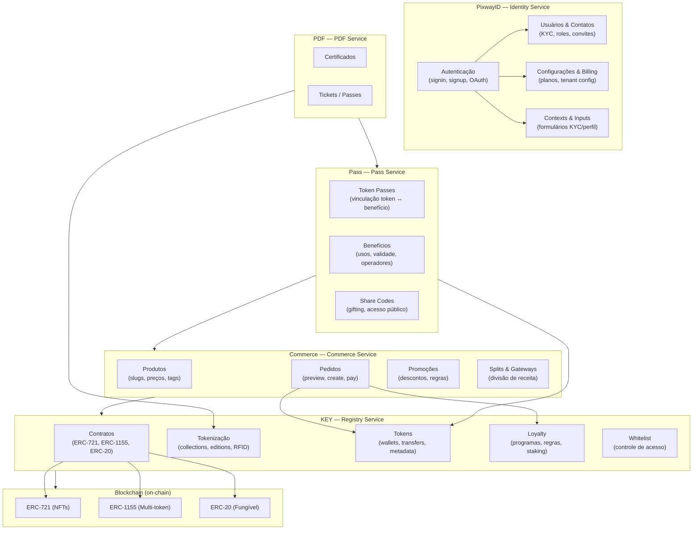

# Visão Geral da Arquitetura do Ecossistema W3Block

---

## Mapa de Serviços



---

## URLs Base por Serviço

| Serviço | URL de Produção | Swagger | Módulos |
|---------|-----------------|---------|---------|
| **PixwayID** | `https://pixwayid.w3block.io` | [/docs](https://pixwayid.w3block.io/docs/) | auth, contacts, kyc, settings, configurations |
| **KEY** | `https://api.w3block.io` | [/docs](https://api.w3block.io/docs/) | contracts, tokenization, tokens, loyalty, whitelist, user-profile |
| **Commerce** | `https://commerce.w3block.io` | [/docs](https://commerce.w3block.io/docs/) | commerce, checkout |
| **Pass** | `https://pass.w3block.io` | [/docs](https://pass.w3block.io/docs/) | pass |
| **PDF** | `https://pdf.w3block.io` | [/docs](https://pdf.w3block.io/docs/) | pdf |

---

## Mapa de Módulos por Serviço

### PixwayID (`pixwayid.w3block.io`)

| Módulo | Skills Disponíveis |
|--------|-------------------|
| Auth | [admin/auth](../admin/auth/AUTH_SKILL_INDEX.md) · [references/auth](../references/auth/AUTH_API_REFERENCE.md) |
| Contacts / KYC | [admin/contacts](../admin/contacts/CONTACTS_SKILL_INDEX.md) · [admin/kyc](../admin/kyc/FLOW_KYC_APPROVAL.md) |
| Settings & Billing | [admin/settings](../admin/settings/SETTINGS_SKILL_INDEX.md) · [references/settings](../references/settings/SETTINGS_API_REFERENCE.md) |
| Configurations | [admin/configurations](../admin/configurations/CONFIGURATIONS_SKILL_INDEX.md) · [references/configurations](../references/configurations/CONFIGURATIONS_API_REFERENCE.md) |

### KEY — Registry (`api.w3block.io`)

| Módulo | Skills Disponíveis |
|--------|-------------------|
| Contracts | [admin/contracts](../admin/contracts/CONTRACTS_SKILL_INDEX.md) · [references/contracts](../references/contracts/CONTRACTS_API_REFERENCE.md) |
| Tokenization | [admin/tokenization](../admin/tokenization/TOKENIZATION_SKILL_INDEX.md) · [references/tokenization](../references/tokenization/TOKENIZATION_API_REFERENCE.md) |
| Tokens | [user/tokens](../user/tokens/TOKENS_SKILL_INDEX.md) · [references/tokens](../references/tokens/TOKENS_API_REFERENCE.md) |
| Loyalty | [admin/loyalty](../admin/loyalty/LOYALTY_SKILL_INDEX.md) · [references/loyalty](../references/loyalty/LOYALTY_API_REFERENCE.md) |
| Whitelist | [admin/whitelist](../admin/whitelist/WHITELIST_SKILL_INDEX.md) · [references/whitelist](../references/whitelist/WHITELIST_API_REFERENCE.md) |
| User Profile / Withdrawals | [admin/user-profile](../admin/user-profile/USER_PROFILE_SKILL_INDEX.md) · [references/user-profile](../references/user-profile/USER_PROFILE_API_REFERENCE.md) |

### Commerce (`commerce.w3block.io`)

| Módulo | Skills Disponíveis |
|--------|-------------------|
| Commerce | [admin/commerce](../admin/commerce/COMMERCE_SKILL_INDEX.md) · [references/commerce](../references/commerce/COMMERCE_API_REFERENCE.md) |
| Checkout | [user/checkout](../user/checkout/CHECKOUT_SKILL_INDEX.md) · [references/checkout](../references/checkout/CHECKOUT_API_REFERENCE.md) |

### Pass (`pass.w3block.io`)

| Módulo | Skills Disponíveis |
|--------|-------------------|
| Pass (admin) | [admin/pass](../admin/pass/PASS_SKILL_INDEX.md) · [references/pass](../references/pass/PASS_API_REFERENCE.md) |
| Pass (user) | [user/pass](../user/pass/FLOW_PASS_SELF_USE.md) |

### PDF (`pdf.w3block.io`)

| Módulo | Skills Disponíveis |
|--------|-------------------|
| PDF | [admin/pdf](../admin/pdf/PDF_SKILL_INDEX.md) · [references/pdf](../references/pdf/PDF_API_REFERENCE.md) |

---

## Fluxo Típico de uma Integração Completa

```
1. Autenticação (PixwayID)
   └─ Obter JWT via POST /auth/signin

2. Configuração de Produto (Commerce + KEY)
   ├─ Criar contrato ERC-721 (KEY)
   ├─ Criar collection + edition (KEY)
   └─ Criar produto vinculado à edition (Commerce)

3. Venda (Commerce + KEY)
   ├─ Preview do pedido (Commerce)
   ├─ Criar order (Commerce)
   ├─ Pagar (Commerce — PIX, cartão, crypto, etc.)
   └─ Mint do token para o comprador (KEY — automático)

4. Benefícios (Pass)
   ├─ Criar token pass vinculado ao token (Pass)
   ├─ Configurar benefícios (Pass)
   └─ Usuário usa benefícios via QR Code (Pass)

5. Fidelidade (KEY — Loyalty)
   ├─ Contrato ERC-20 para pontos (KEY)
   ├─ Programa de fidelidade com regras (KEY)
   └─ Cashback automático em compras (KEY + Commerce)
```

---

## Dependências entre Módulos

| Para fazer isso... | ...você precisa primeiro de... |
|-------------------|-------------------------------|
| Criar produto para venda | Contrato deployado + Edition criada |
| Mintar tokens | Contrato + Collection + Edition |
| Configurar loyalty | Contrato ERC-20 deployado |
| Criar token pass | Tokens existentes |
| Gerar PDF de certificado | Template configurado + token/order |
| Usar whitelist em venda | Whitelist criada + Product configurado |
| Fluxo KYC | Context + Inputs configurados no tenant |
